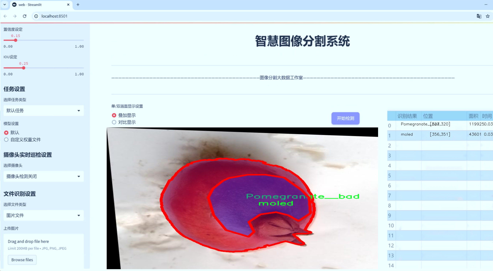
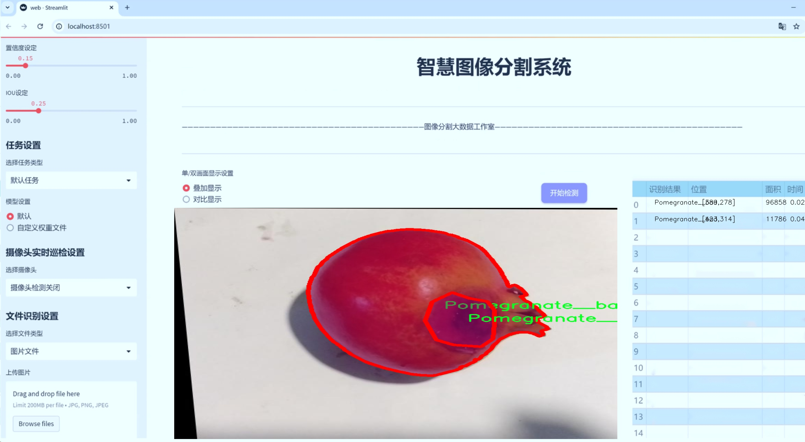
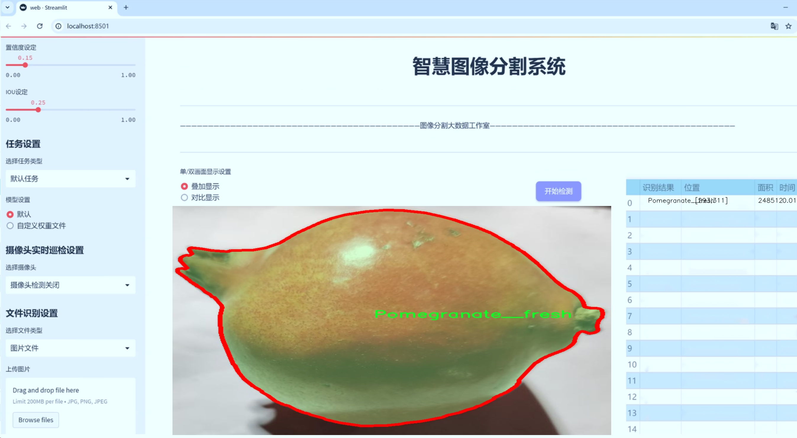
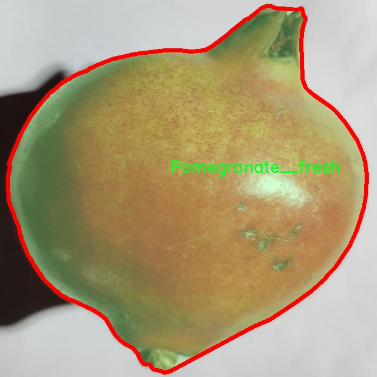
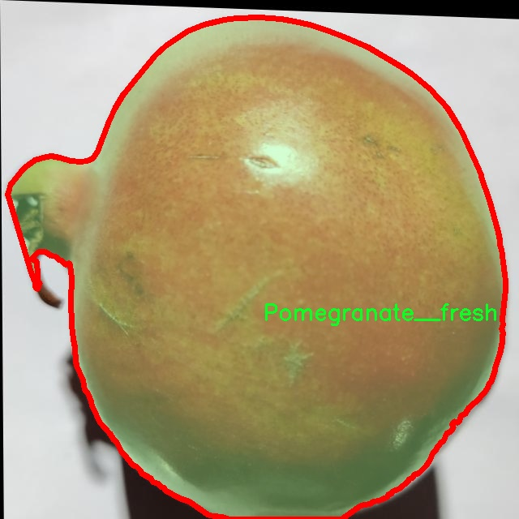
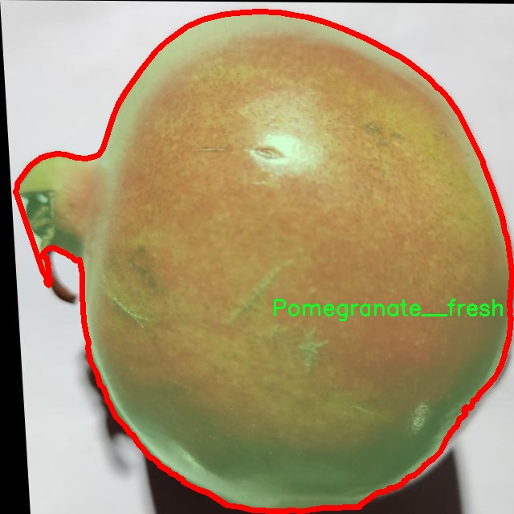
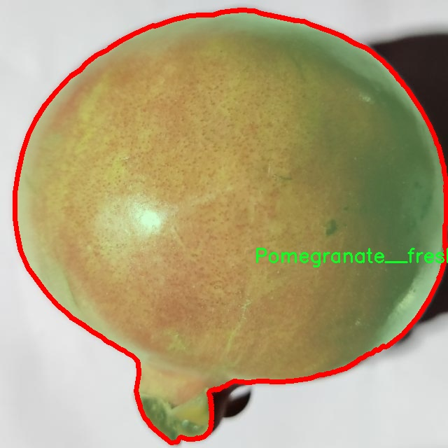
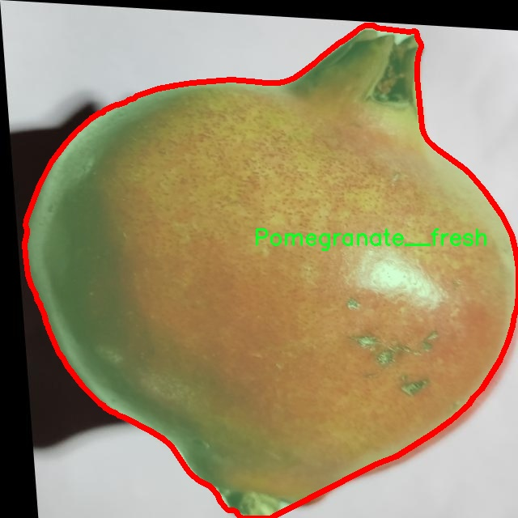

# 石榴病害品质识别图像分割系统： yolov8-seg-RCSOSA

### 1.研究背景与意义

[参考博客](https://gitee.com/YOLOv8_YOLOv11_Segmentation_Studio/projects)

[博客来源](https://kdocs.cn/l/cszuIiCKVNis)

研究背景与意义

随着全球农业现代化进程的加快，农作物病害的监测与管理已成为确保农业生产安全和提高农产品质量的重要环节。石榴作为一种经济价值较高的水果，其种植面积逐年扩大，但与此同时，石榴病害的发生也对其产量和品质造成了严重威胁。传统的病害识别方法多依赖于人工观察和经验判断，效率低下且容易出现误判，难以满足现代农业生产对精准管理的需求。因此，开发一种高效、准确的石榴病害识别系统显得尤为重要。

近年来，深度学习技术的迅猛发展为图像处理领域带来了新的机遇，尤其是在目标检测和图像分割方面。YOLO（You Only Look Once）系列模型因其高效的实时检测能力和良好的准确性，已广泛应用于各种视觉识别任务中。YOLOv8作为该系列的最新版本，进一步提升了模型的性能和适用性，成为研究者们关注的焦点。然而，针对特定作物病害的图像分割任务，现有的YOLOv8模型仍存在一定的局限性，尤其是在处理复杂背景和细微特征方面。因此，基于改进YOLOv8的石榴病害品质识别图像分割系统的研究具有重要的理论价值和实际意义。

本研究将基于一个包含4500张图像的数据集进行深入探讨，该数据集涵盖了四个主要类别：坏果、鲜果、裂果和霉变果。这些类别不仅反映了石榴在生长过程中可能遭遇的多种病害和品质问题，也为模型的训练和测试提供了丰富的样本支持。通过对这些图像进行标注和分析，我们能够深入理解不同病害对石榴品质的影响，从而为后续的病害管理提供科学依据。

改进YOLOv8模型的核心在于提升其在石榴病害识别中的分割精度和鲁棒性。通过引入先进的图像增强技术、特征提取方法以及多尺度检测策略，期望能够有效提高模型对不同病害特征的敏感性和适应性。此外，结合迁移学习和自监督学习等技术，能够进一步提升模型在小样本情况下的表现，解决数据集标注不足的问题。这些技术的应用不仅有助于提高石榴病害识别的准确性，还能为其他农作物的病害监测提供借鉴。

综上所述，基于改进YOLOv8的石榴病害品质识别图像分割系统的研究，不仅能够推动农业智能化发展，还能为农民提供有效的病害管理工具，最终实现提高石榴产量和品质的目标。通过本研究的深入，期望能够为农业生产的可持续发展贡献一份力量，同时为相关领域的研究提供新的思路和方法。

### 2.图片演示







注意：本项目提供完整的训练源码数据集和训练教程,由于此博客编辑较早,暂不提供权重文件（best.pt）,需要按照6.训练教程进行训练后实现上图效果。

### 3.视频演示

[3.1 视频演示](https://www.bilibili.com/video/BV1KXUNYXE9U/)

### 4.数据集信息

##### 4.1 数据集类别数＆类别名

nc: 4
names: ['Pomegranate__bad', 'Pomegranate__fresh', 'crack', 'moled']


##### 4.2 数据集信息简介

数据集信息展示

在本研究中，我们采用了名为“metal_segmentation”的数据集，以支持改进YOLOv8-seg的石榴病害品质识别图像分割系统的训练和评估。该数据集专注于石榴的不同品质状态，特别是针对病害和缺陷的分类，为模型提供了丰富的视觉信息，以提高其在实际应用中的准确性和鲁棒性。

“metal_segmentation”数据集包含四个主要类别，分别是“Pomegranate__bad”、“Pomegranate__fresh”、“crack”和“moled”。每个类别代表了石榴在不同生长阶段或受到不同病害影响时的特征表现。具体而言，“Pomegranate__bad”类别涵盖了那些因病害或环境因素而表现出明显劣质特征的石榴，这些特征可能包括变色、腐烂或其他病害迹象。该类别的图像将为模型提供关于病害特征的直观样本，使其能够有效识别并分类出受损的石榴。

相对而言，“Pomegranate__fresh”类别则代表了健康、成熟的石榴，其外观鲜艳、表面光滑，几乎没有任何缺陷。这一类别的图像将帮助模型学习到理想的石榴品质特征，从而在分类时能够准确区分健康与病害石榴。通过将新鲜石榴的特征与受损石榴的特征进行对比，模型将能够更好地理解何为“正常”状态，并在实际应用中作出更为精准的判断。

此外，“crack”类别专注于那些表面出现裂纹的石榴，这种情况可能是由于生长过程中的水分波动或环境压力引起的。裂纹不仅影响石榴的外观，还可能导致进一步的腐烂和病害，因此，准确识别这一类别对于果农和供应链管理者来说至关重要。最后，“moled”类别则包括那些表面有霉斑的石榴，这通常是由于储存条件不当或过度潮湿引起的。霉变不仅影响石榴的市场价值，也可能对消费者的健康构成威胁，因此及时识别这一类别的石榴对于保障食品安全具有重要意义。

整个数据集的构建旨在为改进YOLOv8-seg模型提供全面的训练样本，确保模型能够在多种环境和条件下进行有效的图像分割和分类。通过对这四个类别的深度学习，模型将能够更好地适应不同的石榴品质特征，进而提升其在实际应用中的表现。数据集中的图像经过精心标注，确保每个类别的样本都具有代表性，能够真实反映石榴在生长和储存过程中可能出现的各种情况。

综上所述，“metal_segmentation”数据集为本研究提供了丰富的图像数据，涵盖了石榴品质识别所需的关键特征。通过利用这一数据集，我们期望能够显著提升YOLOv8-seg模型在石榴病害品质识别中的准确性和效率，为果农和相关行业提供更为可靠的技术支持。











### 5.项目依赖环境部署教程（零基础手把手教学）

[5.1 环境部署教程链接（零基础手把手教学）](https://www.bilibili.com/video/BV1jG4Ve4E9t/?vd_source=bc9aec86d164b67a7004b996143742dc)


[5.2 安装Python虚拟环境创建和依赖库安装视频教程链接（零基础手把手教学）](https://www.bilibili.com/video/BV1nA4VeYEze/?vd_source=bc9aec86d164b67a7004b996143742dc)

### 6.手把手YOLOV8-seg训练视频教程（零基础手把手教学）

[6.1 手把手YOLOV8-seg训练视频教程（零基础小白有手就能学会）](https://www.bilibili.com/video/BV1cA4VeYETe/?vd_source=bc9aec86d164b67a7004b996143742dc)


按照上面的训练视频教程链接加载项目提供的数据集，运行train.py即可开始训练



     Epoch   gpu_mem       box       obj       cls    labels  img_size
     1/200     0G   0.01576   0.01955  0.007536        22      1280: 100%|██████████| 849/849 [14:42<00:00,  1.04s/it]
               Class     Images     Labels          P          R     mAP@.5 mAP@.5:.95: 100%|██████████| 213/213 [01:14<00:00,  2.87it/s]
                 all       3395      17314      0.994      0.957      0.0957      0.0843

     Epoch   gpu_mem       box       obj       cls    labels  img_size
     2/200     0G   0.01578   0.01923  0.007006        22      1280: 100%|██████████| 849/849 [14:44<00:00,  1.04s/it]
               Class     Images     Labels          P          R     mAP@.5 mAP@.5:.95: 100%|██████████| 213/213 [01:12<00:00,  2.95it/s]
                 all       3395      17314      0.996      0.956      0.0957      0.0845

     Epoch   gpu_mem       box       obj       cls    labels  img_size
     3/200     0G   0.01561    0.0191  0.006895        27      1280: 100%|██████████| 849/849 [10:56<00:00,  1.29it/s]
               Class     Images     Labels          P          R     mAP@.5 mAP@.5:.95: 100%|███████   | 187/213 [00:52<00:00,  4.04it/s]
                 all       3395      17314      0.996      0.957      0.0957      0.0845


### 7.50+种全套YOLOV8-seg创新点加载调参实验视频教程（一键加载写好的改进模型的配置文件）

[7.1 50+种全套YOLOV8-seg创新点加载调参实验视频教程（一键加载写好的改进模型的配置文件）](https://www.bilibili.com/video/BV1Hw4VePEXv/?vd_source=bc9aec86d164b67a7004b996143742dc)

### YOLOV8-seg算法简介

原始YOLOv8-seg算法原理

YOLOv8-seg算法是Ultralytics团队在YOLO系列的基础上进行的又一次重大创新，旨在实现更高效的目标检测与图像分割。该算法的设计理念是基于快速、准确和易于使用的原则，特别适合于广泛的计算机视觉任务，包括目标检测、图像分割和图像分类。YOLOv8-seg不仅在性能上进行了提升，还在网络结构和训练策略上进行了诸多改进，使其在处理复杂的视觉任务时展现出更强的鲁棒性和灵活性。

YOLOv8-seg的网络结构主要由三个部分组成：Backbone、Neck和Head。Backbone部分负责特征提取，Neck部分进行特征融合，而Head部分则负责最终的目标检测和分类任务。具体来说，Backbone采用了一系列卷积和反卷积层，通过残差连接和瓶颈结构来减小网络的大小并提高性能。YOLOv8-seg的Backbone由多个CBS模块、C2f模块和一个快速空间金字塔池化（SPPF）模块组成，后者的引入有效地增强了模型对多尺度特征的捕捉能力。

在Backbone中，C2f模块的设计是YOLOv8-seg的一大亮点。与之前的C3模块相比，C2f模块引入了更多的跳层连接，这种设计不仅丰富了梯度流信息，还在保持模型轻量化的同时提升了特征提取的精度。通过这种方式，YOLOv8-seg能够更好地捕捉到图像中的细节信息，为后续的目标检测和分割任务奠定了坚实的基础。

Neck部分则采用了多尺度特征融合技术，旨在将来自Backbone不同阶段的特征图进行有效融合，以便更好地捕捉不同尺度目标的信息。这一过程通过去除冗余的卷积连接层和直接进行上采样操作来实现，进一步提高了目标检测的性能和鲁棒性。Neck的设计确保了YOLOv8-seg在处理多种目标尺寸时的灵活性，使得算法在各种应用场景中都能表现出色。

Head部分是YOLOv8-seg的核心，它负责最终的目标检测和分类任务。与以往的YOLO版本不同，YOLOv8-seg采用了解耦头的设计思路，将检测和分类任务分为两个独立的分支。这样一来，分类任务可以更加专注于特征图中提取到的特征与已有类别之间的相似性，而定位任务则更关注边界框与真实框的位置关系。这种解耦设计不仅提高了模型的收敛速度，还提升了预测的精度。

YOLOv8-seg还引入了无锚框结构，直接预测目标的中心位置，并通过任务对齐学习（Task Alignment Learning）来区分正负样本。这一创新使得YOLOv8-seg在处理不同类型的目标时更加灵活，减少了对预设锚框的依赖，进而简化了模型的设计。此外，YOLOv8-seg在损失函数的设计上也进行了优化，结合了分类分数和IOU的高次幂乘积作为衡量任务对齐程度的指标，从而在分类和定位损失函数中引入了这一指标，确保了模型在同时拥有良好的定位和分类性能。

在数据处理方面，YOLOv8-seg在训练过程中采用了Mosaic数据增强技术，旨在提高模型的鲁棒性和泛化能力。Mosaic增强通过将多张图像随机拼接成一张新图像，迫使模型学习不同位置和周围像素的组合，从而有效提升了预测精度。然而，YOLOv8-seg在训练的最后阶段停止使用Mosaic增强，以避免对数据真实分布的破坏，这一策略的引入进一步优化了模型的训练过程。

在实际应用中，YOLOv8-seg的性能表现优异。根据在COCO数据集上的测试结果，YOLOv8-seg在同尺寸模型下，能够在不显著增加参数数量的前提下，取得更高的精度和更快的推理速度。这一特性使得YOLOv8-seg在实时目标检测和图像分割任务中具备了广泛的应用潜力，尤其是在需要快速响应的场景中，如自动驾驶、智能监控和机器人视觉等领域。

综上所述，YOLOv8-seg算法通过对网络结构的精心设计和训练策略的优化，展现出在目标检测和图像分割任务中的强大能力。其独特的解耦头设计、无锚框结构以及多尺度特征融合技术，使得YOLOv8-seg在面对复杂的视觉任务时，能够保持高效、准确的性能表现。随着YOLOv8-seg的不断发展和应用，其在计算机视觉领域的影响力将愈加显著，成为未来研究和应用的重要方向。


### 9.系统功能展示（检测对象为举例，实际内容以本项目数据集为准）

图9.1.系统支持检测结果表格显示

  图9.2.系统支持置信度和IOU阈值手动调节

  图9.3.系统支持自定义加载权重文件best.pt(需要你通过步骤5中训练获得)

  图9.4.系统支持摄像头实时识别

  图9.5.系统支持图片识别

  图9.6.系统支持视频识别

  图9.7.系统支持识别结果文件自动保存

  图9.8.系统支持Excel导出检测结果数据


### 10.50+种全套YOLOV8-seg创新点原理讲解（非科班也可以轻松写刊发刊，V11版本正在科研待更新）

#### 10.1 由于篇幅限制，每个创新点的具体原理讲解就不一一展开，具体见下列网址中的创新点对应子项目的技术原理博客网址【Blog】：


[10.1 50+种全套YOLOV8-seg创新点原理讲解链接](https://gitee.com/qunmasj/good)

#### 10.2 部分改进模块原理讲解(完整的改进原理见上图和技术博客链接)【如果此小节的图加载失败可以通过CSDN或者Github搜索该博客的标题访问原始博客，原始博客图片显示正常】
### 可变性卷积DCN简介
卷积神经网络由于其构建模块中固定的几何结构，本质上受限于模型几何变换。为了提高卷积神经网络的转换建模能力，《Deformable Convolutional Networks》作者提出了两个模块：可变形卷积（deformable convolution）和可变形RoI池（deformable RoI pooling）。这两个模块均基于用额外的偏移来增加模块中的空间采样位置以及从目标任务中学习偏移的思想，而不需要额外的监督。

第一次证明了在深度神经网络中学习密集空间变换（dense spatial transformation）对于复杂的视觉任务是有效的

视觉识别中的一个关键挑战是如何适应对象比例、姿态、视点和零件变形中的几何变化或模型几何变换。一般有两种方法实现：
1）建立具有足够期望变化的训练数据集。这通常通过增加现有的数据样本来实现，例如通过仿射变换。但是训练成本昂贵而且模型参数庞大。
2）使用变换不变（transformation-invariant）的特征和算法。比如比较有名的SIFT(尺度不变特征变换)便是这一类的代表算法。

但以上的方法有两个缺点：
1）几何变换被假定为固定的和已知的，这些先验知识被用来扩充数据，设计特征和算法。为此，这个假设阻止了对具有未知几何变换的新任务的推广，从而导致这些几何变换可能没有被正确建模。
2）对于不变特征和算法进行手动设计，对于过于复杂的变换可能是困难的或不可行的。

卷积神经网络本质上局限于模拟大型未知转换。局限性源于CNN模块的固定几何结构：卷积单元在固定位置对输入特征图进行采样；池化层以固定比率降低特征矩阵分辨率；RoI（感兴趣区域）池化层将RoI分成固定的空间箱（spatial bins）等。缺乏处理几何变换的内部机制。

这种内部机制的缺乏会导致一些问题，举个例子。同一个CNN层中所有激活单元的感受野大小是相同的，但是这是不可取的。因为不同的位置可能对应于具有不同尺度或变形的对象，所以尺度或感受野大小的自适应确定对于具有精细定位的视觉识别是渴望的。

对于这些问题，作者提出了两个模块提高CNNs对几何变换建模的能力。


deformable convolution（可变形卷积）
将2D偏移量添加到标准卷积中的常规网格采样位置，使得采样网格能够自由变形。通过额外的卷积层，从前面的特征映射中学习偏移。因此，变形采用局部、密集和自适应的方式取决于输入特征。


deformable RoI pooling（可变形RoI池化）
为先前RoI池化的常规库（bin）分区中的每个库位置（bin partition）增加了一个偏移量。类似地，偏移是从前面的特征图和感兴趣区域中学习的，从而能够对具有不同形状的对象进行自适应部件定位（adaptive part localization）。

#### Deformable Convolutional Networks
Deformable Convolution
2D卷积由两个步骤组成：
1）在输入特征图x xx上使用规则网格R RR进行采样。
2）把这些采样点乘不同权重w ww后相加。

网格R定义感受野大小和扩张程度，比如内核大小为3x3，扩张程度为1的网格R可以表示为：
R = { ( − 1 , − 1 ) , ( − 1 , 0 ) , … , ( 0 , 1 ) , ( 1 , 1 ) } R = \{(-1,-1),(-1,0),\dots,(0,1),(1,1)\}
R={(−1,−1),(−1,0),…,(0,1),(1,1)}

​
 一般为小数，使用双线性插值进行处理。（把小数坐标分解到相邻的四个整数坐标点来计算结果）


具体操作如图所示：


首先对输入特征层进行一个普通的3x3卷积处理得到偏移域（offset field）。偏移域特征图具有与输入特征图相同的空间分辨率，channels维度2N对应于N个2D（xy两个方向）偏移。其中的N是原输入特征图上所具有的N个channels，也就是输入输出channels保持不变，这里xy两个channels分别对输出特征图上的一个channels进行偏移。确定采样点后就通过与相对应的权重w点乘相加得到输出特征图上该点最终值。

前面也提到过，由于这里xy两个方向所训练出来的偏移量一般来说是一个小数，那么为了得到这个点所对应的数值，会采用双线性插值的方法，从最近的四个邻近坐标点中计算得到该偏移点的数值，公式如下：


具体推理过程见：双线性插值原理

#### Deformable RoI Poolingb
所有基于区域提议（RPN）的对象检测方法都使用RoI池话处理，将任意大小的输入矩形区域转换为固定大小的特征图。


 一般为小数，需要使用双线性插值进行处理。


具体操作如图所示：


当时看这个部分的时候觉得有些突兀，明明RoI池化会将特征层转化为固定尺寸的区域。其实，我个人觉得，这个部分与上述的可变性卷积操作是类似的。这里同样是使用了一个普通的RoI池化操作，进行一些列处理后得到了一个偏移域特征图，然后重新作用于原来的w × H w \times Hw×H的RoI。只不过这里不再是规律的逐行逐列对每个格子进行池化，而是对于格子进行偏移后再池化处理。

#### Postion﹣Sensitive RoI Pooling
除此之外，论文还提出一种PS RoI池化（Postion﹣Sensitive RoI Pooling）。不同于上述可变形RoI池化中的全连接过程，这里使用全卷积替换。

具体操作如图所示：


首先，对于原来的特征图来说，原本是将输入特征图上的RoI区域分成k × k k\times kk×k个bin。而在这里，则是将输入特征图进行卷积操作，分别得到一个channels为k 2 ( C + 1 ) k^{2}(C+1)k (C+1)的得分图（score maps）和一个channels为2 k 2 ( C + 1 ) 2k{2}(C+1)2k 2 (C+1)的偏移域（offset fields），这两个特征矩阵的宽高是与输入特征矩阵相同的。其中，得分图的channels中，k × k k \times kk×k分别表示的是每一个网格，C CC表示的检测对象的类别数目，1表示背景。而在偏移域中的2表示xy两个方向的偏移。
也就是说，在PS RoI池化中，对于RoI的每一个网格都独自占一个通道形成一层得分图，然后其对于的偏移量占两个通道。offset fields得到的偏移是归一化后的偏移，需要通过和deformable RoI pooling中一样的变换方式得到∆ p i j ∆p_{ij}∆p ij，然后对每层得分图进行偏移池化处理。最后处理完的结果就对应着最后输出的一个网格。所以其包含了位置信息。

原文论述为：


#### Understanding Deformable ConvNets
当可变形卷积叠加时，复合变形的效果是深远的。如图所示：


ps：a是标准卷积的固定感受野，b是可变形卷积的适应性感受野。

感受野和标准卷积中的采样位置在整个顶部特征图上是固定的(左)。在可变形卷积中，它们根据对象的比例和形状进行自适应调整(右)。


### 11.项目核心源码讲解（再也不用担心看不懂代码逻辑）

#### 11.1 ultralytics\models\yolo\segment\__init__.py

以下是对给定代码的核心部分进行提炼和详细注释的结果：

```python
# 导入必要的模块和类
from .predict import SegmentationPredictor  # 导入用于图像分割预测的类
from .train import SegmentationTrainer      # 导入用于训练图像分割模型的类
from .val import SegmentationValidator       # 导入用于验证图像分割模型的类

# 定义模块的公开接口，指定可以被外部访问的类
__all__ = 'SegmentationPredictor', 'SegmentationTrainer', 'SegmentationValidator'
```

### 代码解析：

1. **模块导入**：
   - `from .predict import SegmentationPredictor`：从当前包的 `predict` 模块中导入 `SegmentationPredictor` 类，该类负责处理图像分割的预测任务。
   - `from .train import SegmentationTrainer`：从当前包的 `train` 模块中导入 `SegmentationTrainer` 类，该类用于训练图像分割模型。
   - `from .val import SegmentationValidator`：从当前包的 `val` 模块中导入 `SegmentationValidator` 类，该类用于验证训练好的图像分割模型的性能。

2. **公开接口定义**：
   - `__all__` 是一个特殊的变量，用于定义模块的公共接口。当使用 `from module import *` 语句时，只有在 `__all__` 中列出的名称会被导入。这里列出了三个类，表明它们是该模块的核心功能部分。

通过以上分析，可以看出这段代码的主要目的是组织和导出与图像分割相关的功能类，以便于其他模块或用户进行调用和使用。

这个文件是Ultralytics YOLO项目中的一个模块初始化文件，主要用于导入和管理与图像分割相关的类和功能。文件开头的注释表明该项目使用的是AGPL-3.0许可证，说明其开源性质和使用条款。

在文件中，首先从同一目录下导入了三个重要的类：`SegmentationPredictor`、`SegmentationTrainer`和`SegmentationValidator`。这些类分别负责图像分割任务中的预测、训练和验证功能。具体来说，`SegmentationPredictor`用于执行图像分割的预测操作，`SegmentationTrainer`用于训练模型以进行图像分割，而`SegmentationValidator`则用于验证训练后的模型性能。

最后，`__all__`变量定义了该模块的公共接口，指定了当使用`from module import *`语句时，哪些名称会被导入。在这里，它包含了之前导入的三个类。这种做法有助于清晰地管理模块的公共API，确保用户只访问到模块中希望公开的部分。

总的来说，这个文件在整个YOLO图像分割模块中起到了组织和导入的作用，使得其他模块或文件能够方便地使用这些核心功能。

#### 11.2 ultralytics\models\sam\modules\transformer.py

以下是代码中最核心的部分，并附上详细的中文注释：

```python
import math
import torch
from torch import Tensor, nn

class Attention(nn.Module):
    """注意力层，允许在投影到查询、键和值后对嵌入的大小进行下采样。"""

    def __init__(self, embedding_dim: int, num_heads: int, downsample_rate: int = 1) -> None:
        """
        初始化注意力模型，设置维度和参数。

        Args:
            embedding_dim (int): 输入嵌入的维度。
            num_heads (int): 注意力头的数量。
            downsample_rate (int, optional): 内部维度下采样的因子，默认为1。
        """
        super().__init__()
        self.embedding_dim = embedding_dim
        self.internal_dim = embedding_dim // downsample_rate  # 计算内部维度
        self.num_heads = num_heads
        assert self.internal_dim % num_heads == 0, 'num_heads必须能整除embedding_dim。'

        # 定义线性投影层
        self.q_proj = nn.Linear(embedding_dim, self.internal_dim)  # 查询的线性投影
        self.k_proj = nn.Linear(embedding_dim, self.internal_dim)  # 键的线性投影
        self.v_proj = nn.Linear(embedding_dim, self.internal_dim)  # 值的线性投影
        self.out_proj = nn.Linear(self.internal_dim, embedding_dim)  # 输出的线性投影

    @staticmethod
    def _separate_heads(x: Tensor, num_heads: int) -> Tensor:
        """将输入张量分离为指定数量的注意力头。"""
        b, n, c = x.shape  # b: 批量大小, n: 序列长度, c: 特征维度
        x = x.reshape(b, n, num_heads, c // num_heads)  # 重塑为 B x N x N_heads x C_per_head
        return x.transpose(1, 2)  # 转置为 B x N_heads x N_tokens x C_per_head

    @staticmethod
    def _recombine_heads(x: Tensor) -> Tensor:
        """将分离的注意力头重新组合为单个张量。"""
        b, n_heads, n_tokens, c_per_head = x.shape
        x = x.transpose(1, 2)  # 转置为 B x N_tokens x N_heads x C_per_head
        return x.reshape(b, n_tokens, n_heads * c_per_head)  # 重塑为 B x N_tokens x C

    def forward(self, q: Tensor, k: Tensor, v: Tensor) -> Tensor:
        """根据输入的查询、键和值张量计算注意力输出。"""

        # 输入投影
        q = self.q_proj(q)  # 查询投影
        k = self.k_proj(k)  # 键投影
        v = self.v_proj(v)  # 值投影

        # 分离为多个头
        q = self._separate_heads(q, self.num_heads)
        k = self._separate_heads(k, self.num_heads)
        v = self._separate_heads(v, self.num_heads)

        # 计算注意力
        _, _, _, c_per_head = q.shape
        attn = q @ k.permute(0, 1, 3, 2)  # 计算注意力分数
        attn = attn / math.sqrt(c_per_head)  # 缩放
        attn = torch.softmax(attn, dim=-1)  # 应用softmax以获得注意力权重

        # 获取输出
        out = attn @ v  # 计算加权值
        out = self._recombine_heads(out)  # 重新组合头
        return self.out_proj(out)  # 输出投影
```

### 代码核心部分说明：
1. **Attention类**：实现了基本的注意力机制，包含了查询、键和值的线性投影，并通过多头注意力的方式处理输入。
2. **_separate_heads和_recombine_heads方法**：用于将输入张量分离成多个注意力头以及将它们重新组合，方便在多头注意力中进行计算。
3. **forward方法**：实现了注意力的计算流程，包括输入的投影、注意力分数的计算、应用softmax和最终的输出。

以上代码片段展示了注意力机制的基本实现，适用于各种深度学习任务，如图像处理和自然语言处理等。

这个程序文件定义了一个名为 `TwoWayTransformer` 的类，主要用于实现一种双向变换器模块，能够同时关注图像和查询点。该类作为一个专门的变换器解码器，利用提供的查询位置嵌入来关注输入图像。这种结构特别适用于目标检测、图像分割和点云处理等任务。

在 `TwoWayTransformer` 类的构造函数中，定义了一些重要的属性，包括变换器的层数（`depth`）、输入嵌入的通道维度（`embedding_dim`）、多头注意力的头数（`num_heads`）、MLP块的内部通道维度（`mlp_dim`）等。类中还包含一个 `layers` 属性，它是一个 `nn.ModuleList`，用于存储多个 `TwoWayAttentionBlock` 层。

在 `forward` 方法中，输入的图像嵌入、图像位置编码和查询点嵌入被处理。首先，图像嵌入被展平并重新排列，以便与查询点嵌入进行匹配。接着，依次通过每个 `TwoWayAttentionBlock` 层进行处理。最后，应用一个最终的注意力层，将查询点的输出与图像嵌入结合，并进行层归一化处理。

`TwoWayAttentionBlock` 类实现了一个注意力块，能够执行自注意力和交叉注意力，支持查询到键和键到查询的双向操作。该块包含四个主要层：稀疏输入的自注意力、稀疏输入到密集输入的交叉注意力、稀疏输入的MLP块，以及密集输入到稀疏输入的交叉注意力。在 `forward` 方法中，首先进行自注意力处理，然后进行交叉注意力处理，接着通过MLP块进行变换，最后再次进行交叉注意力处理。

`Attention` 类实现了一个注意力层，允许在投影到查询、键和值之后对嵌入的大小进行下采样。构造函数中初始化了输入嵌入的维度、注意力头的数量和下采样率。该类还定义了 `_separate_heads` 和 `_recombine_heads` 两个静态方法，用于将输入张量分离成多个注意力头和重新组合。

总体而言，这个程序文件实现了一个复杂的双向变换器结构，能够有效地处理图像和查询点之间的关系，适用于多种计算机视觉任务。

#### 11.3 ultralytics\utils\callbacks\wb.py

以下是经过简化和注释的核心代码部分：

```python
# 导入必要的库
from ultralytics.utils import SETTINGS, TESTS_RUNNING
from ultralytics.utils.torch_utils import model_info_for_loggers

# 尝试导入wandb库并进行基本的设置检查
try:
    assert not TESTS_RUNNING  # 确保当前不是测试状态
    assert SETTINGS['wandb'] is True  # 确保wandb集成已启用
    import wandb as wb  # 导入wandb库

    assert hasattr(wb, '__version__')  # 确保wandb库不是目录

    import numpy as np  # 导入numpy库
    import pandas as pd  # 导入pandas库

    _processed_plots = {}  # 用于存储已处理的图表

except (ImportError, AssertionError):
    wb = None  # 如果导入失败，设置wb为None


def _custom_table(x, y, classes, title='Precision Recall Curve', x_title='Recall', y_title='Precision'):
    """
    创建并记录自定义的精确度-召回率曲线可视化。
    
    参数:
        x (List): x轴的值，长度为N。
        y (List): y轴的值，长度为N。
        classes (List): 每个点的类别标签，长度为N。
        title (str, optional): 图表标题，默认为'Precision Recall Curve'。
        x_title (str, optional): x轴标签，默认为'Recall'。
        y_title (str, optional): y轴标签，默认为'Precision'。

    返回:
        (wandb.Object): 适合记录的wandb对象，展示自定义的可视化指标。
    """
    # 创建一个DataFrame用于存储数据
    df = pd.DataFrame({'class': classes, 'y': y, 'x': x}).round(3)
    fields = {'x': 'x', 'y': 'y', 'class': 'class'}
    string_fields = {'title': title, 'x-axis-title': x_title, 'y-axis-title': y_title}
    
    # 返回一个wandb表格对象
    return wb.plot_table('wandb/area-under-curve/v0',
                         wb.Table(dataframe=df),
                         fields=fields,
                         string_fields=string_fields)


def _plot_curve(x, y, names=None, id='precision-recall', title='Precision Recall Curve', x_title='Recall', y_title='Precision', num_x=100, only_mean=False):
    """
    记录指标曲线可视化。

    参数:
        x (np.ndarray): x轴的数据点，长度为N。
        y (np.ndarray): y轴的数据点，形状为CxN，C为类别数量。
        names (list, optional): 类别名称，长度为C。
        id (str, optional): 在wandb中记录数据的唯一标识符，默认为'precision-recall'。
        title (str, optional): 可视化图表的标题，默认为'Precision Recall Curve'。
        x_title (str, optional): x轴标签，默认为'Recall'。
        y_title (str, optional): y轴标签，默认为'Precision'。
        num_x (int, optional): 可视化的插值数据点数量，默认为100。
        only_mean (bool, optional): 是否仅绘制均值曲线，默认为True。
    """
    # 创建新的x值
    if names is None:
        names = []
    x_new = np.linspace(x[0], x[-1], num_x).round(5)

    # 创建用于记录的数组
    x_log = x_new.tolist()
    y_log = np.interp(x_new, x, np.mean(y, axis=0)).round(3).tolist()

    if only_mean:
        # 仅记录均值曲线
        table = wb.Table(data=list(zip(x_log, y_log)), columns=[x_title, y_title])
        wb.run.log({title: wb.plot.line(table, x_title, y_title, title=title)})
    else:
        # 记录每个类别的曲线
        classes = ['mean'] * len(x_log)
        for i, yi in enumerate(y):
            x_log.extend(x_new)  # 添加新的x值
            y_log.extend(np.interp(x_new, x, yi))  # 插值y到新的x
            classes.extend([names[i]] * len(x_new))  # 添加类别名称
        wb.log({id: _custom_table(x_log, y_log, classes, title, x_title, y_title)}, commit=False)


def on_fit_epoch_end(trainer):
    """在每个训练周期结束时记录训练指标和模型信息。"""
    wb.run.log(trainer.metrics, step=trainer.epoch + 1)  # 记录训练指标
    # 记录图表
    _log_plots(trainer.plots, step=trainer.epoch + 1)
    _log_plots(trainer.validator.plots, step=trainer.epoch + 1)
    if trainer.epoch == 0:
        wb.run.log(model_info_for_loggers(trainer), step=trainer.epoch + 1)  # 记录模型信息


def on_train_end(trainer):
    """在训练结束时保存最佳模型作为artifact。"""
    _log_plots(trainer.validator.plots, step=trainer.epoch + 1)  # 记录验证图表
    _log_plots(trainer.plots, step=trainer.epoch + 1)  # 记录训练图表
    art = wb.Artifact(type='model', name=f'run_{wb.run.id}_model')  # 创建artifact
    if trainer.best.exists():
        art.add_file(trainer.best)  # 添加最佳模型文件
        wb.run.log_artifact(art, aliases=['best'])  # 记录artifact
    wb.run.finish()  # 结束wandb运行
```

### 代码说明：
1. **导入库**：导入了必要的库，包括`wandb`用于可视化和记录训练过程，`numpy`和`pandas`用于数据处理。
2. **异常处理**：通过`try-except`结构确保在没有安装`wandb`或其他设置不正确时，程序不会崩溃。
3. **自定义表格函数**：`_custom_table`函数用于创建精确度-召回率曲线的可视化表格。
4. **绘制曲线函数**：`_plot_curve`函数根据输入数据生成并记录曲线图，可以选择只记录均值曲线或所有类别的曲线。
5. **训练过程回调**：定义了在训练过程中的不同阶段（如每个周期结束时和训练结束时）执行的回调函数，以记录训练指标和保存模型。

这个程序文件是用于集成WandB（Weights and Biases）库，以便在训练YOLO模型时记录和可视化训练过程中的各种指标和曲线。文件首先导入了一些必要的模块，并检查WandB库是否可用以及是否处于测试状态。若不满足条件，则将WandB设置为None。

文件中定义了几个主要的函数。首先是`_custom_table`函数，它用于创建和记录一个自定义的精确度-召回曲线的可视化。该函数接收x轴和y轴的数据，以及类标签，并生成一个WandB表格对象，以便在WandB中记录。

接下来是`_plot_curve`函数，它用于生成和记录一个指标曲线的可视化。该函数可以处理多个类的数据，并根据`only_mean`参数决定是否只绘制平均曲线。它会插值生成新的x值，并根据输入的y值计算对应的y值，最后调用`_custom_table`函数进行记录。

`_log_plots`函数用于记录输入字典中的图表，如果在指定的步骤中尚未记录过这些图表。它通过检查时间戳来避免重复记录。

接下来的几个函数分别在训练的不同阶段被调用。`on_pretrain_routine_start`函数在预训练例程开始时初始化WandB项目。`on_fit_epoch_end`函数在每个训练周期结束时记录训练指标和模型信息。`on_train_epoch_end`函数在每个训练周期结束时记录损失和学习率，并在特定条件下记录图表。`on_train_end`函数在训练结束时保存最佳模型，并记录验证器的图表和曲线。

最后，文件定义了一个回调字典，包含了上述的回调函数，仅在WandB可用时才会被填充。这个字典可以在训练过程中被调用，以便在适当的时机记录训练过程中的各种信息。

#### 11.4 ultralytics\models\yolo\segment\val.py

以下是代码中最核心的部分，并附上详细的中文注释：

```python
class SegmentationValidator(DetectionValidator):
    """
    扩展自 DetectionValidator 类，用于基于分割模型的验证。
    """

    def __init__(self, dataloader=None, save_dir=None, pbar=None, args=None, _callbacks=None):
        """初始化 SegmentationValidator，并将任务设置为 'segment'，指标设置为 SegmentMetrics。"""
        super().__init__(dataloader, save_dir, pbar, args, _callbacks)
        self.plot_masks = None  # 用于存储绘制的掩码
        self.process = None  # 处理掩码的函数
        self.args.task = 'segment'  # 设置任务类型为分割
        self.metrics = SegmentMetrics(save_dir=self.save_dir, on_plot=self.on_plot)  # 初始化指标

    def preprocess(self, batch):
        """预处理批次数据，将掩码转换为浮点数并发送到设备。"""
        batch = super().preprocess(batch)  # 调用父类的预处理方法
        batch['masks'] = batch['masks'].to(self.device).float()  # 将掩码转移到设备并转换为浮点数
        return batch

    def postprocess(self, preds):
        """后处理 YOLO 预测，返回输出检测结果和原型。"""
        p = ops.non_max_suppression(preds[0],  # 进行非极大值抑制
                                    self.args.conf,
                                    self.args.iou,
                                    labels=self.lb,
                                    multi_label=True,
                                    agnostic=self.args.single_cls,
                                    max_det=self.args.max_det,
                                    nc=self.nc)
        proto = preds[1][-1] if len(preds[1]) == 3 else preds[1]  # 获取原型
        return p, proto  # 返回处理后的预测结果和原型

    def update_metrics(self, preds, batch):
        """更新指标。"""
        for si, (pred, proto) in enumerate(zip(preds[0], preds[1])):
            idx = batch['batch_idx'] == si  # 获取当前批次的索引
            cls = batch['cls'][idx]  # 获取当前批次的类别
            bbox = batch['bboxes'][idx]  # 获取当前批次的边界框
            nl, npr = cls.shape[0], pred.shape[0]  # 标签数量和预测数量
            shape = batch['ori_shape'][si]  # 获取原始形状
            correct_masks = torch.zeros(npr, self.niou, dtype=torch.bool, device=self.device)  # 初始化正确掩码
            correct_bboxes = torch.zeros(npr, self.niou, dtype=torch.bool, device=self.device)  # 初始化正确边界框
            self.seen += 1  # 更新已处理的样本数量

            if npr == 0:  # 如果没有预测
                if nl:  # 如果有标签
                    self.stats.append((correct_bboxes, correct_masks, *torch.zeros((2, 0), device=self.device), cls.squeeze(-1)))
                continue  # 继续下一个批次

            # 处理掩码
            midx = [si] if self.args.overlap_mask else idx  # 根据重叠掩码的参数选择索引
            gt_masks = batch['masks'][midx]  # 获取真实掩码
            pred_masks = self.process(proto, pred[:, 6:], pred[:, :4], shape=batch['img'][si].shape[1:])  # 处理预测掩码

            # 处理预测结果
            if self.args.single_cls:
                pred[:, 5] = 0  # 如果是单类检测，将类别设置为0
            predn = pred.clone()  # 克隆预测结果
            ops.scale_boxes(batch['img'][si].shape[1:], predn[:, :4], shape, ratio_pad=batch['ratio_pad'][si])  # 缩放边界框

            # 评估
            if nl:  # 如果有标签
                height, width = batch['img'].shape[2:]  # 获取图像的高度和宽度
                tbox = ops.xywh2xyxy(bbox) * torch.tensor((width, height, width, height), device=self.device)  # 转换标签边界框
                ops.scale_boxes(batch['img'][si].shape[1:], tbox, shape, ratio_pad=batch['ratio_pad'][si])  # 缩放标签边界框
                labelsn = torch.cat((cls, tbox), 1)  # 合并类别和边界框
                correct_bboxes = self._process_batch(predn, labelsn)  # 处理边界框
                correct_masks = self._process_batch(predn, labelsn, pred_masks, gt_masks, overlap=self.args.overlap_mask, masks=True)  # 处理掩码

            # 更新统计信息
            self.stats.append((correct_bboxes, correct_masks, pred[:, 4], pred[:, 5], cls.squeeze(-1)))

    def _process_batch(self, detections, labels, pred_masks=None, gt_masks=None, overlap=False, masks=False):
        """
        返回正确预测矩阵。

        参数:
            detections (array[N, 6]), x1, y1, x2, y2, conf, class
            labels (array[M, 5]), class, x1, y1, x2, y2

        返回:
            correct (array[N, 10]), 对于10个IoU水平
        """
        if masks:  # 如果处理掩码
            if overlap:  # 如果考虑重叠
                nl = len(labels)
                index = torch.arange(nl, device=gt_masks.device).view(nl, 1, 1) + 1
                gt_masks = gt_masks.repeat(nl, 1, 1)  # 扩展真实掩码
                gt_masks = torch.where(gt_masks == index, 1.0, 0.0)  # 将掩码转换为二值
            if gt_masks.shape[1:] != pred_masks.shape[1:]:  # 如果形状不匹配
                gt_masks = F.interpolate(gt_masks[None], pred_masks.shape[1:], mode='bilinear', align_corners=False)[0]  # 进行插值
                gt_masks = gt_masks.gt_(0.5)  # 二值化
            iou = mask_iou(gt_masks.view(gt_masks.shape[0], -1), pred_masks.view(pred_masks.shape[0], -1))  # 计算IoU
        else:  # 如果处理边界框
            iou = box_iou(labels[:, 1:], detections[:, :4])  # 计算边界框的IoU

        return self.match_predictions(detections[:, 5], labels[:, 0], iou)  # 匹配预测结果

    def finalize_metrics(self, *args, **kwargs):
        """设置评估指标的速度和混淆矩阵。"""
        self.metrics.speed = self.speed  # 设置速度
        self.metrics.confusion_matrix = self.confusion_matrix  # 设置混淆矩阵
```

以上代码是一个用于图像分割模型验证的类，包含了数据预处理、后处理、指标更新等核心功能。注释详细解释了每个方法的作用和参数。

这个程序文件是用于YOLO（You Only Look Once）模型的分割验证的实现，主要功能是对分割模型的输出进行评估和验证。文件中定义了一个名为`SegmentationValidator`的类，它继承自`DetectionValidator`类，专门用于处理分割任务。

在初始化方法中，`SegmentationValidator`类设置了任务类型为“segment”，并初始化了一些用于计算分割性能的指标。它使用`SegmentMetrics`类来跟踪和计算分割相关的性能指标。

`preprocess`方法负责对输入批次进行预处理，将掩码（mask）转换为浮点数并移动到指定的设备（如GPU）。`init_metrics`方法用于初始化性能指标，并根据是否需要保存JSON格式的结果来选择掩码处理函数。

`get_desc`方法返回一个格式化的字符串，描述评估指标的各个方面。`postprocess`方法对YOLO模型的预测结果进行后处理，使用非极大值抑制（NMS）来过滤预测框，并返回处理后的预测结果和原型（proto）。

`update_metrics`方法是该类的核心，负责更新性能指标。它遍历每个预测结果，计算正确的掩码和边界框，并更新统计信息。如果没有预测结果，则跳过该批次。对于每个批次，它还会处理掩码的重叠情况，并将正确的掩码和边界框添加到统计信息中。

`finalize_metrics`方法用于设置评估指标的速度和混淆矩阵。`_process_batch`方法则是用于处理每个批次的检测结果和标签，计算IoU（Intersection over Union）并返回正确的预测矩阵。

`plot_val_samples`和`plot_predictions`方法用于可视化验证样本和预测结果，分别绘制带有标签的图像和带有掩码及边界框的预测图像。`pred_to_json`方法将预测结果保存为JSON格式，便于后续的评估。

最后，`eval_json`方法用于计算COCO风格的目标检测评估指标，利用pycocotools库对预测结果和真实标注进行比较，计算mAP（mean Average Precision）等指标。

总体来说，这个文件实现了一个完整的分割模型验证流程，包括数据预处理、模型预测、性能指标计算和结果可视化等功能，适用于YOLO系列模型的分割任务。

#### 11.5 ui_style.py

以下是经过简化和注释的核心代码部分：

```python
import base64
import streamlit as st

# 读取二进制文件并转换为 Base64 编码
def get_base64_of_bin_file(bin_file):
    # 以二进制模式打开文件
    with open(bin_file, 'rb') as file:
        # 读取文件内容
        data = file.read()
    # 将读取的二进制数据进行 Base64 编码并解码为字符串
    return base64.b64encode(data).decode()

# 定义 Streamlit 应用的 CSS 样式
def def_css_hitml():
    st.markdown("""
        <style>
        /* 全局样式 */
        .css-2trqyj, .css-1d391kg, .st-bb, .st-at {
            font-family: 'Gill Sans', 'Gill Sans MT', Calibri, 'Trebuchet MS', sans-serif; /* 设置字体 */
            background-color: #cadefc; /* 设置背景颜色 */
            color: #21618C; /* 设置字体颜色 */
        }

        /* 按钮样式 */
        .stButton > button {
            border: none; /* 去掉边框 */
            color: white; /* 字体颜色为白色 */
            padding: 10px 20px; /* 设置内边距 */
            text-align: center; /* 文本居中 */
            display: inline-block; /* 使按钮为块级元素 */
            font-size: 16px; /* 设置字体大小 */
            margin: 2px 1px; /* 设置外边距 */
            cursor: pointer; /* 鼠标悬停时显示为手型 */
            border-radius: 8px; /* 设置圆角 */
            background-color: #9896f1; /* 设置背景颜色 */
            box-shadow: 0 2px 4px 0 rgba(0,0,0,0.2); /* 设置阴影效果 */
            transition-duration: 0.4s; /* 设置过渡效果时间 */
        }
        .stButton > button:hover {
            background-color: #5499C7; /* 悬停时改变背景颜色 */
            color: white; /* 悬停时字体颜色为白色 */
            box-shadow: 0 8px 12px 0 rgba(0,0,0,0.24); /* 悬停时改变阴影效果 */
        }

        /* 表格样式 */
        table {
            border-collapse: collapse; /* 合并边框 */
            margin: 25px 0; /* 设置外边距 */
            font-size: 18px; /* 设置字体大小 */
            font-family: sans-serif; /* 设置字体 */
            min-width: 400px; /* 设置最小宽度 */
            box-shadow: 0 5px 15px rgba(0, 0, 0, 0.2); /* 设置阴影效果 */
        }
        thead tr {
            background-color: #a8d8ea; /* 表头背景颜色 */
            color: #ffcef3; /* 表头字体颜色 */
            text-align: left; /* 表头文本左对齐 */
        }
        th, td {
            padding: 15px 18px; /* 设置单元格内边距 */
        }
        tbody tr {
            border-bottom: 2px solid #ddd; /* 设置行底部边框 */
        }
        tbody tr:nth-of-type(even) {
            background-color: #D6EAF8; /* 偶数行背景颜色 */
        }
        tbody tr:last-of-type {
            border-bottom: 3px solid #5499C7; /* 最后一行底部边框 */
        }
        tbody tr:hover {
            background-color: #AED6F1; /* 悬停行背景颜色 */
        }
        </style>
        """, unsafe_allow_html=True)  # 允许使用 HTML 样式
```

### 代码说明：
1. **导入模块**：导入 `base64` 用于编码和解码，导入 `streamlit` 用于构建 Web 应用。
2. **get_base64_of_bin_file 函数**：该函数接受一个二进制文件路径，读取文件内容并将其转换为 Base64 编码的字符串。
3. **def_css_hitml 函数**：该函数定义了 Streamlit 应用的 CSS 样式，设置了全局样式、按钮样式和表格样式，以美化应用界面。使用 `st.markdown` 方法将 CSS 样式应用到 Streamlit 应用中。

这个程序文件 `ui_style.py` 是一个用于设置 Streamlit 应用界面样式的 Python 脚本。首先，它导入了必要的库，包括 `base64` 和 `streamlit`。接下来，定义了一个函数 `get_base64_of_bin_file`，该函数用于读取指定的二进制文件（如图片），并将其内容转换为 Base64 编码。这种编码方式常用于在网页中嵌入图像数据。

然后，定义了一个名为 `def_css_hitml` 的函数，主要用于设置应用的 CSS 样式。通过 `st.markdown` 方法，可以将包含 CSS 代码的字符串插入到 Streamlit 应用中。CSS 样式包括全局样式、按钮样式、侧边栏样式、单选按钮样式、滑块样式、表格样式等。

在全局样式部分，设置了字体和背景颜色，确保应用整体的视觉一致性。按钮样式部分则定义了按钮的外观，包括边框、颜色、内边距、字体大小、边距、圆角、背景色和阴影效果，同时还设置了按钮在鼠标悬停时的样式变化。侧边栏的样式通过设置背景色和文字颜色来提升可读性。

对于单选按钮和滑块，样式也进行了定制，以使其在视觉上更加美观。表格样式则定义了表格的边框、字体、背景色、悬停效果等，增强了数据展示的可读性和交互性。

总的来说，这个文件通过自定义 CSS 样式，旨在提升 Streamlit 应用的用户体验，使其界面更加美观和易于使用。

### 12.系统整体结构（节选）

### 程序整体功能和构架概括

该程序是一个基于Ultralytics YOLO（You Only Look Once）模型的计算机视觉项目，主要用于图像分割和相关任务的训练、验证和可视化。程序的结构模块化，包含多个功能文件，每个文件负责特定的功能或模块。这些模块包括模型的初始化、变换器的实现、训练过程中的回调、验证过程的实现以及用户界面的样式设置。

- **模型初始化**：`__init__.py` 文件负责导入与图像分割相关的核心类，便于其他模块使用。
- **变换器实现**：`transformer.py` 文件实现了双向变换器结构，处理图像和查询点之间的关系，适用于目标检测和图像分割任务。
- **训练回调**：`wb.py` 文件集成了WandB库，用于记录和可视化训练过程中的指标和曲线，便于监控模型性能。
- **验证过程**：`val.py` 文件实现了分割模型的验证逻辑，包括性能指标的计算和结果的可视化。
- **用户界面样式**：`ui_style.py` 文件通过自定义CSS样式，提升了Streamlit应用的用户体验，使其界面更加美观和易于使用。

### 文件功能整理表

| 文件路径                                         | 功能描述                                                         |
|--------------------------------------------------|------------------------------------------------------------------|
| `ultralytics/models/yolo/segment/__init__.py`   | 导入和管理与图像分割相关的核心类，如SegmentationPredictor、SegmentationTrainer和SegmentationValidator。 |
| `ultralytics/models/sam/modules/transformer.py` | 实现双向变换器结构，处理图像和查询点之间的关系，适用于目标检测和图像分割任务。 |
| `ultralytics/utils/callbacks/wb.py`             | 集成WandB库，记录和可视化训练过程中的指标和曲线，便于监控模型性能。 |
| `ultralytics/models/yolo/segment/val.py`        | 实现分割模型的验证逻辑，包括性能指标的计算和结果的可视化。 |
| `ui_style.py`                                    | 设置Streamlit应用的CSS样式，提升用户界面的美观性和可用性。 | 

这个表格清晰地总结了每个文件的功能，有助于理解整个程序的架构和各个模块之间的关系。

### 13.图片、视频、摄像头图像分割Demo(去除WebUI)代码

在这个博客小节中，我们将讨论如何在不使用WebUI的情况下，实现图像分割模型的使用。本项目代码已经优化整合，方便用户将分割功能嵌入自己的项目中。
核心功能包括图片、视频、摄像头图像的分割，ROI区域的轮廓提取、类别分类、周长计算、面积计算、圆度计算以及颜色提取等。
这些功能提供了良好的二次开发基础。

### 核心代码解读

以下是主要代码片段，我们会为每一块代码进行详细的批注解释：

```python
import random
import cv2
import numpy as np
from PIL import ImageFont, ImageDraw, Image
from hashlib import md5
from model import Web_Detector
from chinese_name_list import Label_list

# 根据名称生成颜色
def generate_color_based_on_name(name):
    ......

# 计算多边形面积
def calculate_polygon_area(points):
    return cv2.contourArea(points.astype(np.float32))

...
# 绘制中文标签
def draw_with_chinese(image, text, position, font_size=20, color=(255, 0, 0)):
    image_pil = Image.fromarray(cv2.cvtColor(image, cv2.COLOR_BGR2RGB))
    draw = ImageDraw.Draw(image_pil)
    font = ImageFont.truetype("simsun.ttc", font_size, encoding="unic")
    draw.text(position, text, font=font, fill=color)
    return cv2.cvtColor(np.array(image_pil), cv2.COLOR_RGB2BGR)

# 动态调整参数
def adjust_parameter(image_size, base_size=1000):
    max_size = max(image_size)
    return max_size / base_size

# 绘制检测结果
def draw_detections(image, info, alpha=0.2):
    name, bbox, conf, cls_id, mask = info['class_name'], info['bbox'], info['score'], info['class_id'], info['mask']
    adjust_param = adjust_parameter(image.shape[:2])
    spacing = int(20 * adjust_param)

    if mask is None:
        x1, y1, x2, y2 = bbox
        aim_frame_area = (x2 - x1) * (y2 - y1)
        cv2.rectangle(image, (x1, y1), (x2, y2), color=(0, 0, 255), thickness=int(3 * adjust_param))
        image = draw_with_chinese(image, name, (x1, y1 - int(30 * adjust_param)), font_size=int(35 * adjust_param))
        y_offset = int(50 * adjust_param)  # 类别名称上方绘制，其下方留出空间
    else:
        mask_points = np.concatenate(mask)
        aim_frame_area = calculate_polygon_area(mask_points)
        mask_color = generate_color_based_on_name(name)
        try:
            overlay = image.copy()
            cv2.fillPoly(overlay, [mask_points.astype(np.int32)], mask_color)
            image = cv2.addWeighted(overlay, 0.3, image, 0.7, 0)
            cv2.drawContours(image, [mask_points.astype(np.int32)], -1, (0, 0, 255), thickness=int(8 * adjust_param))

            # 计算面积、周长、圆度
            area = cv2.contourArea(mask_points.astype(np.int32))
            perimeter = cv2.arcLength(mask_points.astype(np.int32), True)
            ......

            # 计算色彩
            mask = np.zeros(image.shape[:2], dtype=np.uint8)
            cv2.drawContours(mask, [mask_points.astype(np.int32)], -1, 255, -1)
            color_points = cv2.findNonZero(mask)
            ......

            # 绘制类别名称
            x, y = np.min(mask_points, axis=0).astype(int)
            image = draw_with_chinese(image, name, (x, y - int(30 * adjust_param)), font_size=int(35 * adjust_param))
            y_offset = int(50 * adjust_param)

            # 绘制面积、周长、圆度和色彩值
            metrics = [("Area", area), ("Perimeter", perimeter), ("Circularity", circularity), ("Color", color_str)]
            for idx, (metric_name, metric_value) in enumerate(metrics):
                ......

    return image, aim_frame_area

# 处理每帧图像
def process_frame(model, image):
    pre_img = model.preprocess(image)
    pred = model.predict(pre_img)
    det = pred[0] if det is not None and len(det)
    if det:
        det_info = model.postprocess(pred)
        for info in det_info:
            image, _ = draw_detections(image, info)
    return image

if __name__ == "__main__":
    cls_name = Label_list
    model = Web_Detector()
    model.load_model("./weights/yolov8s-seg.pt")

    # 摄像头实时处理
    cap = cv2.VideoCapture(0)
    while cap.isOpened():
        ret, frame = cap.read()
        if not ret:
            break
        ......

    # 图片处理
    image_path = './icon/OIP.jpg'
    image = cv2.imread(image_path)
    if image is not None:
        processed_image = process_frame(model, image)
        ......

    # 视频处理
    video_path = ''  # 输入视频的路径
    cap = cv2.VideoCapture(video_path)
    while cap.isOpened():
        ret, frame = cap.read()
        ......
```


### 14.完整训练+Web前端界面+50+种创新点源码、数据集获取


# [下载链接：https://mbd.pub/o/bread/Z5Wblppx](https://mbd.pub/o/bread/Z5Wblppx)